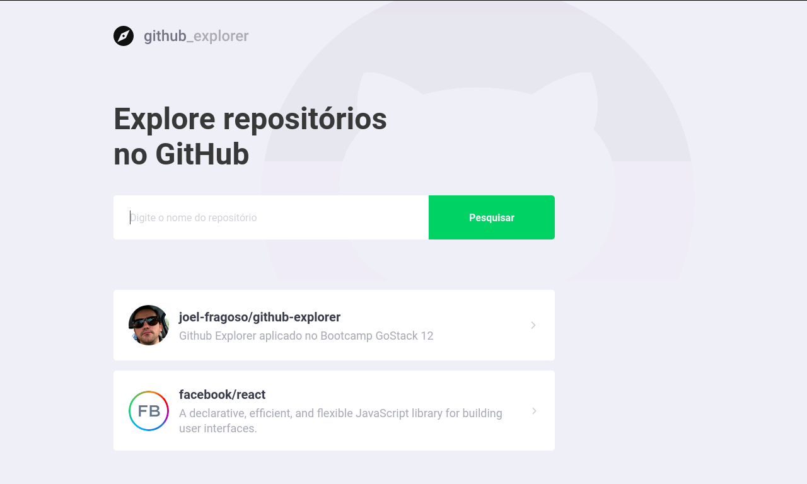
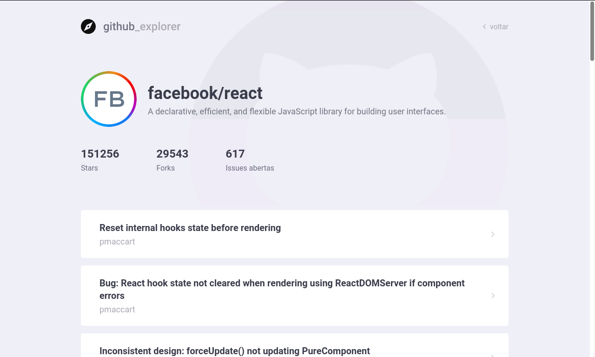

<p align="center">
  
</p>

<h3 align="center">GitHub Explorer</h3>

<p align="center">
  

  

  

  
</p>

<hr>
<p align="center">
  <a href=#overview>Overview</a>&nbsp;&nbsp;&nbsp;|&nbsp;&nbsp;&nbsp;
  <a href=#tecnologias>Tecnologias</a>&nbsp;&nbsp;&nbsp;|&nbsp;&nbsp;&nbsp;
  <a href=#como-usar>Como usar?</a>&nbsp;&nbsp;&nbsp;|&nbsp;&nbsp;&nbsp;
  <a href=#licença>Licença</a>
</p>
<hr>

## Overview

<p align="center">
  
  
</p>

## Tecnologias

- [ReactJS](https://pt-br.reactjs.org/)
- [React Router DOM](https://reacttraining.com/react-router/web/guides/quick-start)
- [Styled Components](https://styled-components.com/)
- [Axios](https://github.com/axios/axios)
- [Typescript](https://www.typescriptlang.org/)

## Como usar?

Para executar este projeto você vai precisar ter instalado o [Git](https://git-scm.com/), [Node.js](https://nodejs.org/en/), [Yarn](https://yarnpkg.com/) e o [ReactJS](https://pt-br.reactjs.org/) no seu computador.

### Clonando o repositório

```bash
# Utilizando HTTP
$ git clone https://github.com/joel-fragoso/github-explorer.git

ou

# Utilizando SSH
$ git clone git@github.com:joel-fragoso/github-explorer.git
```

depois acesse a pasta

```bash
$ cd github-explorer-master
```

### Instalando as dependências
```bash
$ yarn install
```

### Executando projeto
```bash
$ yarn start
```

## Licença

Este projeto está sobre Licença MIT. Veja mais em [LICENSE](LICENSE).

<hr>

Feito com ❤️ por Joel Fragoso 👋️ [LinkedIn!](https://www.linkedin.com/in/joel-fragoso-0906611a9/)
